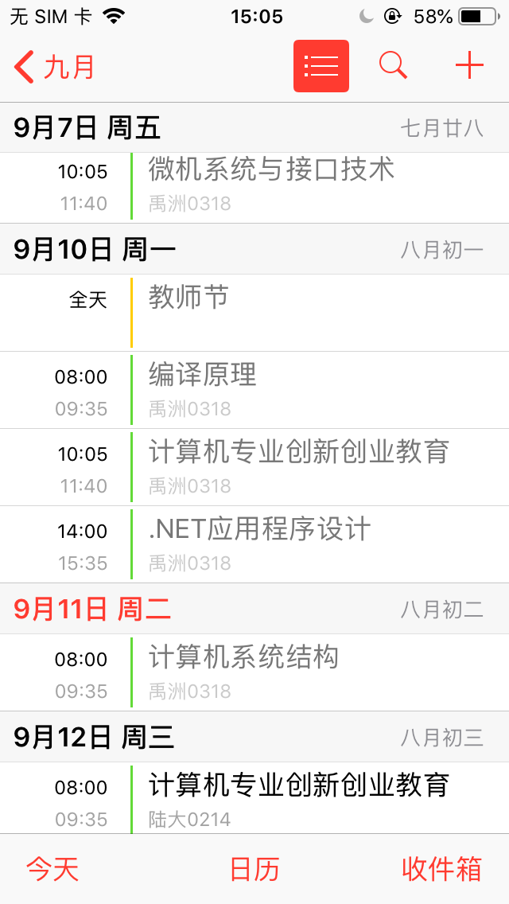

# JMU Class Schedule To iCalender
将集美大学课程表转换成 [iCalendar](https://tools.ietf.org/html/rfc2445) 文件，方便将课程表导入到 Android、iOS 等设备中，实时查看今日的课程。

程序仅支持在 Python3 环境下运行。

# Usage

如果你的 Python 默认不是 Python3，请使用 `pip3` 与 `python3` 替换下文命令中的 `pip` 与 `python`。

```bash
git clone https://github.com/LGiki/JMUClassScheduleToiCalender.git
cd JMUClassScheduleToiCalender
pip install -r requirements.txt
python jmu_class_schedule_to_ics.py
```

之后根据程序提示，分别输入：`集大通用户名`、`集大通密码`、`学期第一周星期一的日期`即可。

# Screenshot

将生成的 ics 文件导入到 iOS 中可以得到以下效果：



添加“日程”小组件到负一屏可以很方便地知道今日课程。

